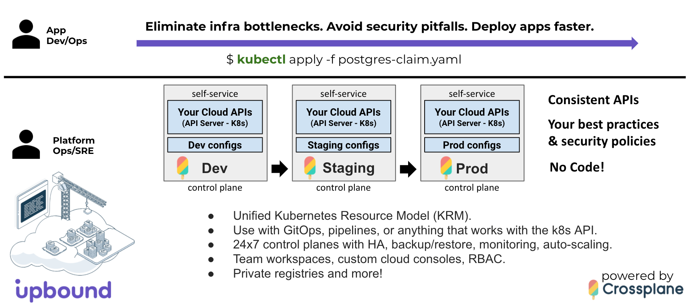
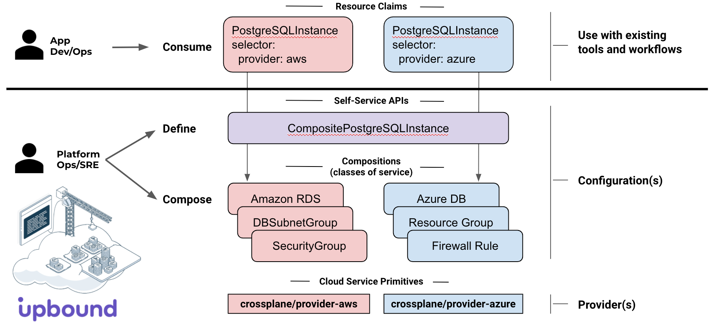
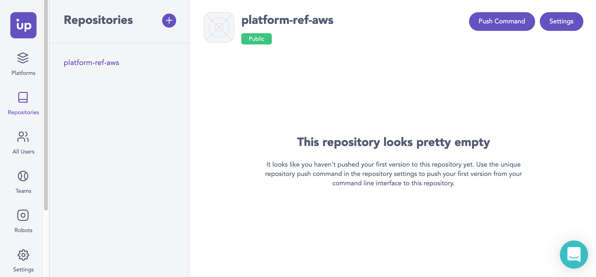

# AWS Reference Platform for Kubernetes + Data Services

This repository contains a reference AWS Platform
[Configuration](https://crossplane.io/docs/v1.3/getting-started/create-configuration.html)
for use as a starting point in [Upbound Cloud](https://upbound.io) or
[Upbound Universal Crossplane (UXP)](https://www.upbound.io/uxp/) to build,
run and operate your own internal cloud platform and offer a self-service
console and API to your internal teams. It provides platform APIs to provision
fully configured EKS clusters, with secure networking, and stateful cloud
services (RDS) designed to securely connect to the nodes in each EKS cluster --
all composed using cloud service primitives from the [Crossplane AWS
Provider](https://doc.crds.dev/github.com/crossplane/provider-aws). App
deployments can securely connect to the infrastructure they need using secrets
distributed directly to the app namespace.

## Contents

* [Upbound Cloud](#upbound-cloud)
* [Build Your Own Internal Cloud Platform](#build-your-own-internal-cloud-platform)
* [Quick Start](#quick-start)
* [Platform Ops/SRE: Run your own internal cloud platform](#platform-opssre-run-your-own-internal-cloud-platform)
  * [App Dev/Ops: Consume the infrastructure you need using kubectl](#app-devops-consume-the-infrastructure-you-need-using-kubectl)
  * [APIs in this Configuration](#apis-in-this-configuration)
* [Customize for your Organization](#customize-for-your-organization)
* [Learn More](#learn-more)

## Upbound Cloud



What if you could eliminate infrastructure bottlenecks, security pitfalls, and
deliver apps faster by providing your teams with self-service APIs that
encapsulate your best practices and security policies, so they can quickly
provision the infrastructure they need using a custom cloud console, `kubectl`,
or deployment pipelines and GitOps workflows -- all without writing code?

[Upbound Cloud](https://upbound.io) enables you to do just that, powered by the
open source [Upbound Universal Crossplane](https://www.upbound.io/uxp/) project.

Consistent self-service APIs can be provided across dev, staging, and
production environments, making it easy for app teams to get the infrastructure
they need using vetted infrastructure configurations that meet the standards
of your organization.

## Build Your Own Internal Cloud Platform

App teams can provision the infrastructure they need with a single YAML file
alongside `Deployments` and `Services` using existing tools and workflows
including tools like `kubectl` and Flux to consume your platform's self-service
APIs.

The Platform `Configuration` defines the self-service APIs and
classes-of-service for each API:

* `CompositeResourceDefinitions` (XRDs) define the platform's self-service
   APIs - e.g. `CompositePostgreSQLInstance`.
* `Compositions` offer the classes-of-service supported for each self-service
   API - e.g. `Standard`, `Performance`, `Replicated`.



Crossplane `Providers` include the cloud service primitives (AWS, Azure, GCP,
Alibaba) used in a `Composition`.

Learn more about `Composition` in the [Crossplane
Docs](https://crossplane.io/docs/v1.3/concepts/composition.html).

## Quick Start

### Platform Ops/SRE: Run your own internal cloud platform

There are two ways to run Universal Crossplane:

1. [Hosted on Upbound Cloud](#upbound-cloud-hosted-uxp-control-plane)
1. Self-hosted on any Kubernetes cluster

To provision the AWS Reference platform, you can pick the option that is best for you.

We'll go through each option in the next sections.

### Upbound Cloud Hosted UXP Control Plane

Hosted Control planes are run on Upbound's cloud infrastructure and provide a restricted
Kubernetes API endpoint that can be accessed via `kubectl` or CI/CD systems.

#### Create a free account in Upbound Cloud

1. Sign up for [Upbound Cloud](https://cloud.upbound.io/register).
1. When you first create an Upbound Account, you can create an Organization

#### Create a Hosted UXP Control Plane in Upbound Cloud

1. Create a `Control Plane` in Upbound Cloud (e.g. dev, staging, or prod).
1. Connect `kubectl` to your `Control Plane` instance.
   * Click on your Control Plane
   * Select the *Connect Using CLI*
   * Paste the commands to configure your local `kubectl` context
   * Test your connectivity by running `kubectl get pods -n upbound-system`

#### Installing UXP on a Kubernetes Cluster

The other option is installing UXP into a Kubernetes cluster you manage using `up`, which
is the official CLI for interacting with Upbound Cloud and Universal Crossplane (UXP).

There are multiple ways to [install up](https://cloud.upbound.io/docs/cli/#install-script),
including Homebrew and Linux packages.

```console
curl -sL https://cli.upbound.io | sh
```

Ensure that your kubectl context is pointing to the correct cluster:

```console
kubectl config current-context
```

Install UXP into the `upbound-system` namespace:

```console
up uxp install
```

Validate the install using the following command:

```console
kubectl get all -n upbound-system
```

#### Install the Crossplane kubectl extension (for convenience)

Now that your kubectl context is configured to connect to a UXP Control Plane,
we can install this reference platform as a Crossplane package.

```console
curl -sL https://raw.githubusercontent.com/crossplane/crossplane/master/install.sh | sh
cp kubectl-crossplane /usr/local/bin
```

#### Install the Platform Configuration

```console
# Check the latest version available in https://cloud.upbound.io/registry/upbound/platform-ref-aws
PLATFORM_VERSION=v0.2.2
PLATFORM_CONFIG=registry.upbound.io/upbound/platform-ref-aws:${PLATFORM_VERSION}

kubectl crossplane install configuration ${PLATFORM_CONFIG}
kubectl get pkg
```

#### Configure Providers in your Platform

A `ProviderConfig` is used to configure Cloud Provider API credentials. Multiple
`ProviderConfig`s can be created, each one pointing to a different credential.

The AWS provider expects a credential `Secret` in the [named profile](https://docs.aws.amazon.com/cli/latest/userguide/cli-configure-profiles.html) format:

```ini
[default]
aws_access_key_id = <your access key ID>
aws_secret_access_key = <your secret access key>
```

This file can be crated manually or by using the [`aws` CLI](https://docs.aws.amazon.com/cli/latest/userguide/cli-chap-install.html):

```console
AWS_PROFILE=default && echo -e "[default]\naws_access_key_id = $(aws configure get aws_access_key_id --profile $AWS_PROFILE)\naws_secret_access_key = $(aws configure get aws_secret_access_key --profile $AWS_PROFILE)" > creds.conf
```

Create the `ProviderConfig` and `Secret` using the credentials file:

```console
kubectl create secret generic aws-creds -n upbound-system --from-file=key=./creds.conf
kubectl apply -f examples/aws-default-provider.yaml
```

We are now ready to provision resources.

#### Create Network Fabric

The example network composition includes the creation of a VPC, Subnets, Route Tables and a Gateway:

```console
kubectl apply -f examples/network.yaml
```

Verify status:

```console
kubectl get claim
kubectl get composite
kubectl get managed
```

#### Invite App Teams to you Organization in Upbound Cloud

1. Create a Team `team1`.
1. Invite app team members and grant access to `Control Planes` and `Repositories`.

### App Dev/Ops: Consume the infrastructure you need using kubectl

#### Join your Organization in Upbound Cloud

1. **Join** your [Upbound Cloud](https://cloud.upbound.io/register)
   `Organization`
1. Verify access to your team `Control Planes` and Registries

#### Provision a CompositePostgreSQLInstance in your team Control Plane GUI console

1. Browse the available self-service APIs (XRDs) Control Plane
1. Provision a `CompositePostgreSQLInstance` using the custom generated GUI for your
Platform `Configuration`
1. View status / details in your `Control Plane` GUI console

#### Connect kubectl to your team Control Plane

1. Connect `kubectl` to a `Control Plane` from the self-service GUI console.

#### Provision a PostgreSQLInstance using kubectl

```console
kubectl apply -f examples/postgres-claim.yaml
```

Verify status:

```console
kubectl get claim
kubectl get composite
kubectl get managed
```

### Cleanup & Uninstall

#### Cleanup Resources

Delete resources created through the `Control Plane` Configurations menu:

* From the `Teams` GUI using the ellipsis menu in the resource view.
* Using `kubectl delete -n team1 <claim-name>`.

Delete resources created using `kubectl`:

```console
kubectl delete -f examples/postgres-claim.yaml
kubectl delete -f examples/network.yaml
```

Verify all underlying resources have been cleanly deleted:

```console
kubectl get managed
```

#### Uninstall Provider & Platform Configuration

```console
kubectl delete configurations.pkg.crossplane.io platform-ref-aws
kubectl delete providers.pkg.crossplane.io provider-aws
kubectl delete providers.pkg.crossplane.io provider-helm
```

#### Uninstall Crossplane kubectl plugin

```console
rm /usr/local/bin/kubectl-crossplane*
```

## APIs in this Configuration

* `Cluster` - provision a fully configured EKS cluster
  * [definition.yaml](cluster/definition.yaml)
  * [composition.yaml](cluster/composition.yaml) includes (transitively):
    * `EKSCluster`
    * `NodeGroup`
    * `Role`
    * `RolePolicyAttachment`
    * `OpenIDConnectProvider`
    * `HelmReleases` for Prometheus and other cluster services.
* `Network` - fabric for a `Cluster` to securely connect to Data Services and
  the Internet.
  * [definition.yaml](network/definition.yaml)
  * [composition.yaml](network/composition.yaml) includes:
    * `VPC`
    * `Subnet`
    * `InternetGateway`
    * `RouteTable`
    * `SecurityGroup`
* `PostgreSQLInstance` - provision a PostgreSQL RDS instance that securely connects to a `Cluster`
  * [definition.yaml](database/postgres/definition.yaml)
  * [composition.yaml](database/postgres/composition.yaml) includes:
    * `RDSInstance`
    * `DBSubnetGroup`

## Customize for your Organization

Create a `Repository` called `platform-ref-aws` in your Upbound Cloud `Organization`:



Set these to match your settings:

```console
UPBOUND_ORG=acme
UPBOUND_ACCOUNT_EMAIL=me@acme.io
REPO=platform-ref-aws
VERSION_TAG=v0.2.2
REGISTRY=registry.upbound.io
PLATFORM_CONFIG=${REGISTRY:+$REGISTRY/}${UPBOUND_ORG}/${REPO}:${VERSION_TAG}
```

Clone the GitHub repo.

```console
git clone https://github.com/upbound/platform-ref-aws.git
cd platform-ref-aws
```

Login to your container registry.

```console
docker login ${REGISTRY} -u ${UPBOUND_ACCOUNT_EMAIL}
```

Build package.

```console
up xpkg build --name package.xpkg --ignore ".github/workflows/*,examples/*,hack/*"
```

Push package to registry.

```console
up xpkg push ${PLATFORM_CONFIG} -f package.xpkg
```

Install package into an Upbound `Control Plane` instance.

```console
kubectl crossplane install configuration ${PLATFORM_CONFIG}
```

The AWS cloud service primitives that can be used in a `Composition` today are
listed in the [Crossplane AWS Provider
Docs](https://doc.crds.dev/github.com/crossplane/provider-aws).

To learn more see [Configuration
Packages](https://crossplane.io/docs/v0.13/getting-started/package-infrastructure.html).

## What's Next

If you're interested in building your own reference platform for your company,
we'd love to hear from you and chat. You can setup some time with us at
info@upbound.io.

For Crossplane questions, drop by [slack.crossplane.io](https://slack.crossplane.io), and say hi!
