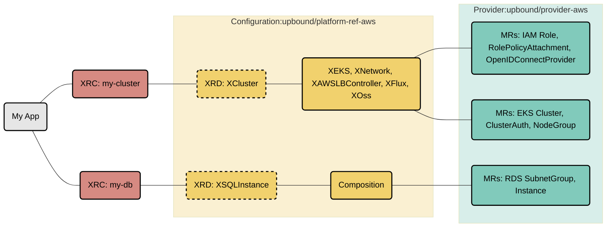

# AWS Reference Platform

This repository contains a reference AWS Platform Configuration for
[Crossplane](https://crossplane.io/) built with [Upbound DevEx](https://docs.upbound.io/devex/). It's a great starting point for building
internal cloud platforms with AWS and offer a self-service API to your internal
development teams.

This platform offers APIs for setting up fully configured EKS clusters
with secure networking, AWS Load Balancer Controller, stateful cloud services (RDS Database) that can securely
connect to the EKS clusters, an Observability Stack, and a GitOps
System. All these components are built using cloud service tools from
the [Official Upbound Family AWS Provider](https://marketplace.upbound.io/providers/upbound/provider-family-aws).
App deployments can securely connect to the infrastructure they need using secrets
distributed directly to the app namespace.

## Architecture

This platform uses **Upbound DevEx** with:
- **Embedded KCL Functions**: Pipeline-mode compositions with embedded KCL functions instead of external patch-and-transform
- **Test-Driven Development**: Comprehensive composition tests and e2e tests
- **Strong Typing**: KCL models for type-safe resource definitions
- **Modern Workflow**: `up project build`, `up test run`, and `up composition render` commands

## Overview

This reference platform outlines a specialized API for generating an EKS cluster
([XCluster](apis/definition.yaml)) that incorporates XRs from the specified configurations:

* [upbound-configuration-aws-lb-controller](https://github.com/upbound/configuration-aws-lb-controller)
* [upbound-configuration-aws-network](https://github.com/upbound/configuration-aws-network)
* [upbound-configuration-aws-eks](https://github.com/upbound/configuration-aws-eks)
* [upbound-configuration-aws-database](https://github.com/upbound/configuration-aws-database)
* [upbound-configuration-app](https://github.com/upbound/configuration-app)
* [upbound-configuration-observability-oss](https://github.com/upbound/configuration-observability-oss)
* [upbound-configuration-gitops-flux](https://github.com/upbound/configuration-gitops-flux)



Learn more about Composite Resources in the [Crossplane
Docs](https://docs.crossplane.io/latest/concepts/compositions/).

## Quickstart

### Installation

Install this platform from the [Upbound Marketplace](https://marketplace.upbound.io/configurations/upbound/platform-ref-aws/):

```console
up ctp configuration install xpkg.upbound.io/upbound/platform-ref-aws:v1.3.0
```

### Development Workflow

This platform uses **Upbound DevEx** for modern development:

```console
# Build the project and compile KCL functions
up project build

# Run composition tests
up test run tests/*

# Render compositions with examples
up composition render apis/definition.yaml apis/composition.yaml examples/cluster-claim.yaml
```

## Using the Platform

Once installed, you can create platform resources using the provided examples:

```console
# Create a cluster with networking, AWS Load Balancer Controller, observability, and GitOps
kubectl apply -f examples/cluster-claim.yaml

# Create a MariaDB database (after cluster is ready)
kubectl apply -f examples/mariadb-claim.yaml

# Deploy a sample application
kubectl apply -f examples/app-claim.yaml
```

Monitor deployment status:

```console
kubectl get claim,composite,managed
```

You can also use the Crossplane CLI for detailed status:

```console
crossplane beta trace cluster.aws.platformref.upbound.io/platform-ref-aws
```

## Development

### Testing

```console
# Run composition tests
up test run tests/*

# Run end-to-end tests
up test run tests/* --e2e
```

### Building and Publishing

```console
# Build the project
up project build

# Deploy locally
up project run
```

For publishing to the marketplace, see the [Upbound documentation](https://docs.upbound.io/devex/).

## Platform Features

This reference platform includes several key features:

### AWS Load Balancer Controller Integration
- Automatic AWS Load Balancer Controller deployment
- VPC ID propagation to avoid EC2 metadata discovery
- Proper webhook management to prevent race conditions

### Intelligent Resource Ordering
- Network resources created first
- EKS cluster provisioned after networking
- Load Balancer Controller deployed after EKS is ready
- Flux and Observability components deployed after Load Balancer Controller to avoid webhook conflicts

### Enhanced Resilience
- Flux deployments with extended timeouts (30 minutes) and rollback limits (15 attempts)
- Conditional resource creation based on readiness status
- Proper usage dependencies for deletion ordering

### Cross-Platform Compatibility
- Uses `crossplane-system` namespace (standard Crossplane)
- Compatible with both UXP and standard Crossplane installations

## Next Steps

- Explore the [examples](examples/) directory for usage patterns
- Check out the [Upbound DevEx documentation](https://docs.upbound.io/devex/) for advanced features
- Join the [Crossplane Slack](https://slack.crossplane.io) community