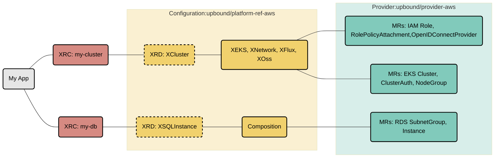

# AWS Reference Platform

This repository contains a reference AWS Platform Configuration for
[Crossplane](https://crossplane.io). It's a great starting point for
building internal cloud platforms with AWS and offering a self-service
API to your internal development teams.

This platform offers APIs for setting up fully configured EKS clusters
with secure networking, stateful cloud services (RDS) that can securely
connect to the EKS clusters, an Observability Stack, and a GitOps
System. All these components are built using cloud service tools from
the [Official Upbound AWS Provider](https://marketplace.upbound.io/providers/upbound/provider-aws).
App deployments can securely access the necessary infrastructure through secrets
distributed directly to the app namespace.

## Overview

This reference platform outlines a specialized API for generating an EKS cluster
([XCluster](apis/pat/definition.yaml)) that incorporates XRs from the specified configurations:

* [upbound-configuration-app](https://github.com/upbound/configuration-app)
* [upbound-configuration-aws-database](https://github.com/upbound/configuration-aws-database)
* [upbound-configuration-aws-eks](https://github.com/upbound/configuration-aws-eks)
* [upbound-configuration-aws-network](https://github.com/upbound/configuration-aws-network)
* [upbound-configuration-gitops-flux](https://github.com/upbound/configuration-gitops-flux)
* [upbound-configuration-observability-oss](https://github.com/upbound/configuration-observability-oss)



Learn more about Composite Resources in the [Crossplane
Docs](https://docs.crossplane.io/latest/concepts/compositions/).

## Quickstart

### Prerequisites

Before we can install the reference platform we should install the `up` CLI.
This is a utility that makes following this quickstart guide easier. Everything
described here can also be done in a declarative approach - which we highly
recommend for any production type use-case.
<!-- TODO enhance this guide: Getting ready for Gitops -->

To install `up` run this install script:
```console
curl -sL https://cli.upbound.io | sh
```
See [up docs](https://docs.upbound.io/cli/) for more install options.

To intstall `crossplane` CLI follow https://docs.crossplane.io/latest/cli/#installing-the-cli

We need a running Crossplane control plane to install our instance. We are
using [Universal Crossplane (UXP)](https://github.com/upbound/universal-crossplane).
Ensure that your kubectl context points to the correct Kubernetes cluster or
create a new [kind](https://kind.sigs.k8s.io) cluster:

```console
kind create cluster
```

Finally install UXP into the `upbound-system` namespace:

```console
up uxp install --set='args[0]=--enable-usages'
```

We will need [Usages](https://docs.crossplane.io/latest/concepts/usages/) alpha feature
for the correct deployment and eventual de-provisioning of this reference platform.

You can validate the install by inspecting all installed components:

```console
kubectl get all -n upbound-system
```

### Install the AWS Reference Platform

Now you can install this reference platform. It's packaged as a [Crossplane
configuration package](https://docs.crossplane.io/latest/concepts/packages/)
so there is a single command to install it:

```console
up ctp configuration install xpkg.upbound.io/upbound/platform-ref-aws:v1.1.0
```

Validate the install by inspecting the provider and configuration packages:
```console
kubectl get configurations,configurationrevisions
kubectl get configurations --watch
```

After all Configurations are ready, you can check the status of associated
Providers that were pulled as dependencies

```console
kubectl get providers,providerrevision
```

Check the
[marketplace](https://marketplace.upbound.io/configurations/upbound/platform-ref-aws/)
for the latest version of this platform.

### Configure the AWS provider

Before we can use the reference platform we need to configure it with AWS
credentials:

```console
# Create a creds.conf file with the aws cli:
AWS_PROFILE=default && echo -e "[default]\naws_access_key_id = $(aws configure get aws_access_key_id --profile $AWS_PROFILE)\naws_secret_access_key = $(aws configure get aws_secret_access_key --profile $AWS_PROFILE)" > creds.conf

# Create a K8s secret with the AWS creds:
kubectl create secret generic aws-creds -n upbound-system --from-file=credentials=./creds.conf

# Configure the AWS Provider to use the secret:
kubectl apply -f examples/aws-default-provider.yaml
```

See [provider-aws docs](https://marketplace.upbound.io/providers/upbound/provider-family-aws)
for more detailed configuration options.

## Using the AWS reference platform

🎉 Congratulations. You have just installed your first Crossplane-powered
platform!

Application developers can now use the platform to request resources which then
will be provisioned in AWS. This would usually be done by bundling a claim as part of
the application code. In our example here we simply create the claims directly:

Create a custom defined cluster:
```console
kubectl apply -f examples/cluster-claim.yaml
```

Create a custom defined database:
```console
kubectl apply -f examples/mariadb-claim.yaml
```

**NOTE**: The database abstraction relies on the cluster claim to be ready - it
uses the same network to have connectivity with the EKS cluster.

Alternatively, you can use a postgresql claim:

```
kubectl apply -f examples/postgres-claim.yaml
```

Now deploy the sample application:

```
kubectl apply -f examples/app-claim.yaml
```

**NOTE**: application has a strong dependency on mariadb type of the database

You can verify the status by inspecting the claims, composites and managed
resources:

```console
kubectl get claim,composite,managed
```

To get nice representation of the Claim deployment status you can use
[crossplane beta trace](https://docs.crossplane.io/latest/cli/command-reference/#beta-trace) command

```console
crossplane beta trace cluster.aws.platformref.upbound.io/platform-ref-aws
```

To delete the provisioned resources you would simply delete the claims:

```console
kubectl delete -f examples/cluster-claim.yaml,examples/mariadb-claim.yaml,examples/app-claim.yaml
```

To uninstall the provider & platform configuration:

```console
kubectl delete configurations.pkg.crossplane.io upbound-platform-ref-aws
kubectl delete configurations.pkg.crossplane.io upbound-configuration-app
kubectl delete configurations.pkg.crossplane.io upbound-configuration-aws-database
kubectl delete configurations.pkg.crossplane.io upbound-configuration-aws-eks
kubectl delete configurations.pkg.crossplane.io upbound-configuration-aws-network
kubectl delete configurations.pkg.crossplane.io upbound-configuration-gitops-flux
kubectl delete configurations.pkg.crossplane.io upbound-configuration-observability-oss

kubectl delete providers.pkg.crossplane.io crossplane-contrib-provider-helm
kubectl delete providers.pkg.crossplane.io crossplane-contrib-provider-kubernetes
kubectl delete providers.pkg.crossplane.io grafana-provider-grafana
kubectl delete providers.pkg.crossplane.io upbound-provider-aws-ec2
kubectl delete providers.pkg.crossplane.io upbound-provider-aws-eks
kubectl delete providers.pkg.crossplane.io upbound-provider-aws-iam
kubectl delete providers.pkg.crossplane.io upbound-provider-aws-rds
kubectl delete providers.pkg.crossplane.io upbound-provider-family-aws
```

## Customize for your Organization

So far we have used the existing reference platform but haven't made any
changes. Let's change this and customize the platform by ensuring the EKS
Cluster is deployed to Frankfurt (eu-central-1) and that clusters are limited
to 10 nodes.

For the following examples we are using `my-org` and `my-platform`:

```console
ORG=my-org
PLATFORM=my-platform
```

### Pre-Requisites
First you need to create a [free Upbound
account](https://accounts.upbound.io/register) to push your custom platform.
Afterwards you can log in:

```console

```

### Make the changes

To make your changes clone this repository:

```console
git clone https://github.com/upbound/platform-ref-aws.git $PLATFORM && cd $PLATFORM
```

### Build and push your platform

To share your new platform you need to build and distribute this package.

To build the package use the `up xpkg build` command:

```console
up xpkg build --name package.xpkg --package-root=. --examples-root=examples --ignore=".github/workflows/*.yaml,.github/workflows/*.yml,examples/*.yaml,.work/uptest-datasource.yaml"
```

Afterwards you can push it to the marketplace. It will be not automatically
listed but the OCI repository will be publicly accessible.

```console
TAG=v0.1.0
up repo -a $ORG create ${PLATFORM}
up xpkg push ${ORG}/${PLATFORM}:${TAG} -f package.xpkg
```

## Using your custom platform

Now to use your custom platform, you can pull the Configuration package from
your repository

```console
up ctp configuration install xpkg.upbound.io/${ORG}/${PLATFORM}:${TAG}
```

For the alternative declarative installation approach see the [example Configuration
manifest](examples/configuration.yaml). Please update to your org, platform and
tag before applying.

🎉 Congratulations. You have just built and installed your first custom
Crossplane-powered platform!


## Questions?

For any questions, thoughts and comments don't hesitate to [reach
out](https://www.upbound.io/contact) or drop by
[slack.crossplane.io](https://slack.crossplane.io), and say hi!
